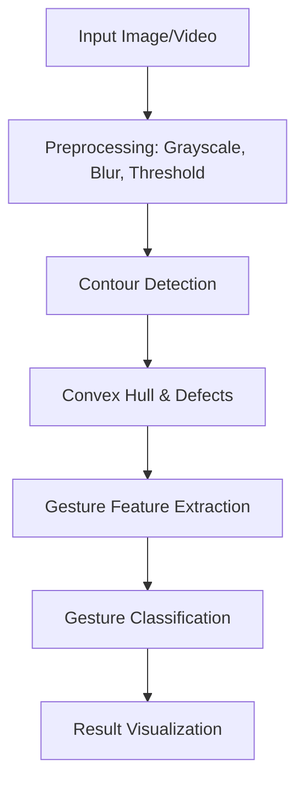

# ✋ Hand Gesture Recognition with Contour Analysis

[](https://opensource.org/licenses/MIT)
[](https://python.org/)
[](https://opencv.org/)
[](https://jupyter.org/)

Hand Gesture Recognition with Contour Analysis is a high-fidelity computer vision project that detects and classifies simple hand gestures using contour geometry, convex hulls, and convexity defects. Designed for robust experimentation and reproducibility, this repository is ideal for academic, research, and prototyping purposes.

---

## 🏗️ Architecture Overview



---

## 📁 Repository Structure

```
Hand Gesture Recognition with Contour Analysis/
├── data/         # Datasets and raw data (zipped files, etc.)
├── notebooks/    # Jupyter notebooks for exploration and prototyping
├── scripts/      # Python scripts for main pipeline and utilities
├── reports/      # Final and intermediate reports, presentations
├── requirements.txt  # Python dependencies
├── .gitignore    # Git ignore file
└── README.md     # Project overview and instructions
```

---

## 🚀 Getting Started

1. **Clone the repository**
2. **Install dependencies**
	```bash
	pip install -r requirements.txt
	```
3. **Explore Notebooks**
	- See `notebooks/` for step-by-step analysis and experiments.
4. **Run Scripts**
	- Place main scripts in `scripts/` for reproducible runs.

---

## 🗂️ Data
- Place all datasets in the `data/` folder. Large files can be zipped.

## 📊 Reports
- All reports and presentations are in the `reports/` folder.

---

## 🛠️ Technical Highlights
- **OpenCV-based Contour Analysis**: Robust hand segmentation and feature extraction.
- **Convex Hull & Defects**: Used for finger counting and gesture recognition.
- **Jupyter Notebooks**: For stepwise experimentation and visualization.
- **Modular Scripts**: Easily extend or adapt for new gesture classes.

---

## 📝 Roadmap
- [ ] Add real-time webcam gesture recognition demo
- [ ] Integrate ML-based gesture classification
- [ ] Expand dataset and gesture vocabulary
- [ ] Improve documentation and add usage examples

---

## 👥 Authors
- Group 9, ECE501 (2025-26)

<p align="center">
  <b>Hand Gesture Recognition</b> – Engineered for Vision, Learning, and Innovation.<br>
  <i>"Where Contours Meet Intelligence."</i>
</p>
